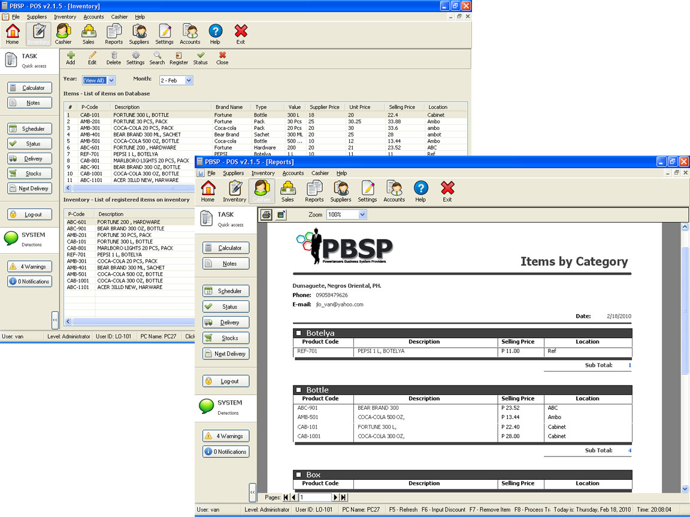



## Advance POS

### Description

Advance POS v1.1. I've uploaded the first version as an application.. The admin deleted it so sorry for that.. Since i cannot share you the whole code of this system. I will just attach here some of my Module Codes. Hope this will help.. ^^

Advance Features:

-Scheduler

-System warning and notifications

-System notes

-System settings and preferences (not complete)

-Group reports (Data report)

-User friendly System

-Reliable Data Handling and retrieving.

-Database backup and restore.

-User accounts management

-others..^^

If you like the system.. Please leave your comments.. Thanks.
 
### More Info
 

             |
---                |---
**Submitted On**   |2010-02-18 07:20:02
**By**             |[Jovanni Lo](https://github.com/Planet-Source-Code/PSCIndex/blob/master/ByAuthor/jovanni-lo.md)
**Level**          |Advanced
**User Rating**    |2.5 (20 globes from 8 users)
**Compatibility**  |VB 6\.0
**Category**       |[Databases/ Data Access/ DAO/ ADO](https://github.com/Planet-Source-Code/PSCIndex/blob/master/ByCategory/databases-data-access-dao-ado__1-6.md)
**World**          |[Visual Basic](https://github.com/Planet-Source-Code/PSCIndex/blob/master/ByWorld/visual-basic.md)
**Archive File**   |[Advance\_PO2174962142010\.zip](https://github.com/Planet-Source-Code/jovanni-lo-advance-pos__1-72922/archive/master.zip)

